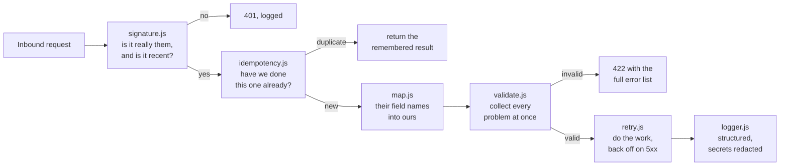

# API & Webhook Integration Patterns

`TECHNICAL LAB`

[](https://github.com/skmalikllc/api-webhook-integration-patterns/actions/workflows/tests.yml)

**This is a technical lab, not a client project.** Nothing here is a client's
system, a client's API or a client's data. It is my own reference
implementation of the parts of an integration that actually break, written so
that a prospective client can read the code rather than take my word for it.

Every module is dependency-free, runs on Node 20+, and is covered by tests that
run in CI on every push.

---

## The problem this addresses

An integration is easy to demonstrate and hard to keep running. The demo is a
POST that works. The system is what happens on the Tuesday when the upstream
form adds a field, the destination API returns 503 for ninety seconds, and the
provider redelivers the same webhook four times because your handler was slow.

Six things separate the two, and each is a file in `src/`.

## Architecture



## The six modules

| Module | The rule it encodes |
|---|---|
| [`src/validate.js`](src/validate.js) | Validate at the boundary and return **every** failure together. A caller who learns about one bad field per round trip gives up on the fourth. |
| [`src/map.js`](src/map.js) | Write the field mapping down as **data**, not code, so the person who knows what "Account Name" means can review it. Report fields the mapping never consumed — silence is how a field that started mattering goes unnoticed. |
| [`src/retry.js`](src/retry.js) | Only retry what a retry can fix. A 400 will be a 400 forever. Use full jitter, because without it every failed job in a batch retries at the same instant and recreates the outage. |
| [`src/idempotency.js`](src/idempotency.js) | Providers redeliver. Without a memory, "delivered twice" means "invoiced twice". |
| [`src/signature.js`](src/signature.js) | Verify HMAC in constant time, and reject stale timestamps — otherwise a captured request can be replayed forever. |
| [`src/logger.js`](src/logger.js) | Redaction belongs in the logger, not in the discipline of whoever writes the next log line. An integration log is the first place a token lands and the last place anyone looks for one. |

## Worked example

[`examples/inbound-webhook.js`](examples/inbound-webhook.js) wires all six into one
handler in the order that matters — **verify → deduplicate → map → validate → act**
— and then delivers the same event twice to show the second one doing no work.

```
$ node examples/inbound-webhook.js
{"ts":"...","level":"info","event":"webhook.unmapped_fields","fields":["id"]}
{"ts":"...","level":"info","event":"webhook.handled","id":"evt_0001","ein":"123456789"}
{ status: 200 }
{ status: 200 }   <- second delivery, no second record
```

Note what the mapping does to the input on the way through: `"  St.  Mary's
Foundation "` becomes `St. Mary's Foundation`, and `12-3456789` becomes
`123456789`. That normalisation is the difference between a duplicate check that
works and one that does not.

## Testing

```bash
npm test                            # 31 unit tests, no dependencies
node examples/inbound-webhook.js    # the worked example, end to end
```

CI runs both on Node 20, 22 and 24.

## Design decisions

1. **No dependencies.** A patterns repository that needs a lockfile to read is a
   worse teaching artefact and a worse dependency.
2. **Clocks and randomness are injected.** `now`, `random` and `sleep` are all
   parameters, which is why the backoff and the replay window can be tested
   deterministically instead of with timers.
3. **The idempotency store is a `Map` on purpose.** Swap it for Redis or a table
   and the call shape is unchanged; the interesting part is *when* it is
   consulted, not where it is stored.
4. **Validation returns data, not exceptions.** A 422 should tell the caller
   everything that is wrong in one response.

## Limitations

- The idempotency store is in-process, so it does not survive a restart or span
  instances. That is a deliberate boundary, not an oversight — see above.
- No HTTP server, no framework adapter. The framework is the least interesting
  part of the problem.
- `validate.js` is a small rule set, not a JSON Schema implementation. If a
  project needs Schema, use Schema.
- `signature.js` implements the common `timestamp.body` HMAC scheme. Providers
  differ; check yours.

## Where this comes from

The patterns are drawn from real automation and integration work — n8n, Make.com
and Zapier builds, Google Workspace automation, and contact-data reconciliation.
The **code in this repository is mine and newly written for it**; no client
system, endpoint or payload is reproduced here.

Related: **[contact-dedupe-mcp](https://github.com/skmalikllc/contact-dedupe-mcp)**
(the matching logic these patterns hand data to) ·
**[workflow-automation-patterns](https://github.com/skmalikllc/workflow-automation-patterns)**
(the same concerns at the n8n/Make/Zapier layer) ·
**[automation-portfolio](https://github.com/skmalikllc/automation-portfolio)** (the full index).

## Licence

MIT.
